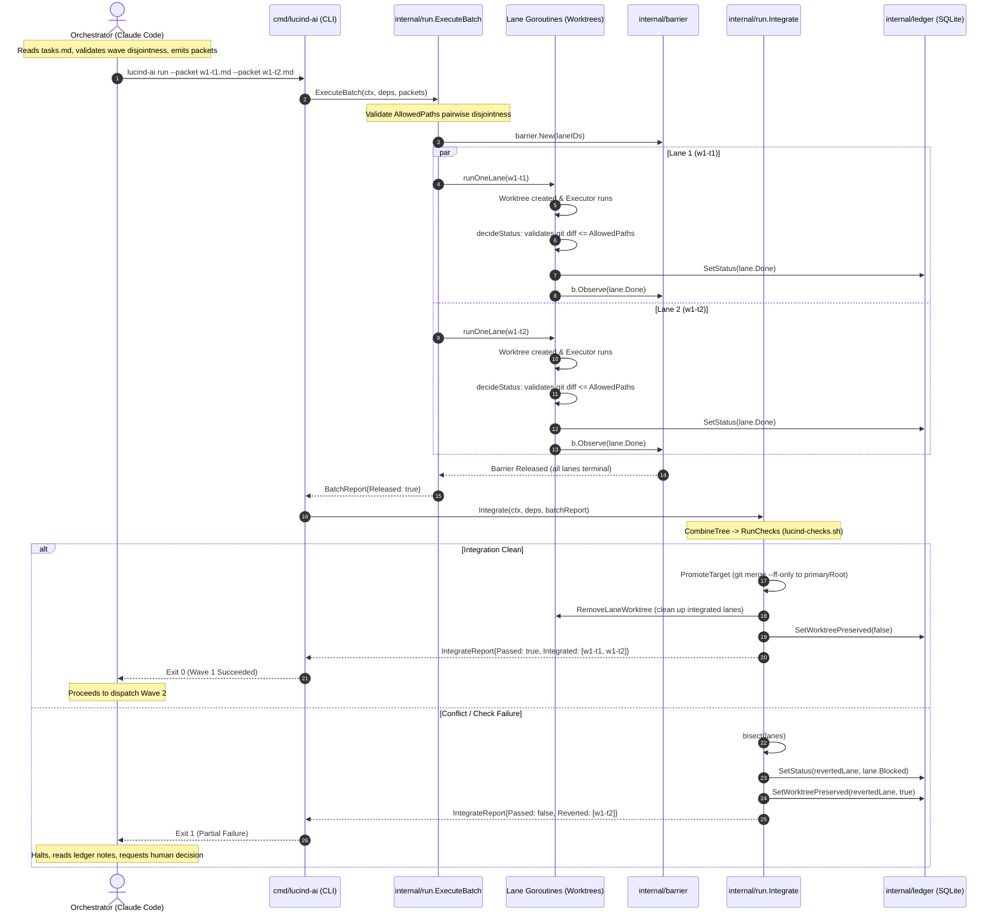

# Design: Apply DAG Dispatch

## Technical Approach

`lucind-ai` transitions the OpenSpec `apply` implementation phase from direct inline edits (`sdd-apply`) to parallel, wave-based binary dispatch via `lucind-ai run`. 

The architecture decomposes an SDD change's `tasks.md` into dependency-ordered waves ($W_1, W_2, \dots, W_k$). Within each wave $W_i$, all task packets are strictly independent and operate on mutually disjoint file scopes (`allowed_paths`).

Each wave is dispatched sequentially by the orchestrator (Claude Code) as a single concurrent batch via `lucind-ai run --packet ...`. The binary executes the wave in parallel linked git worktrees (`../<repo>-worktrees/<id>`), validates terminal status and declared path boundaries in `decideStatus`, joins at the barrier, and merges the completed lane branches into the primary repository via the existing `Integrate`/`Combine`/`bisect`/`resolve` pipeline (`internal/run/integrate.go:30-80`). Once wave $W_i$ is fully integrated and verified against `lucind-checks.sh`, the orchestrator advances to wave $W_{i+1}$, whose worktrees branch from the freshly promoted primary repository commit.

```
+-----------------------------------------------------------------------------------------+
|                                    tasks.md                                             |
|   +---------------------------------+     +-----------------------------------------+   |
|   | Wave 1: Foundation (Disjoint)   |     | Wave 2: Wiring & CLI (Disjoint)         |   |
|   | - Task 1.1: [internal/ledger/*] | --> | - Task 2.1: [internal/run/*]            |   |
|   | - Task 1.2: [internal/packet/*] |     | - Task 2.2: [cmd/lucind-ai/*]           |   |
|   +---------------------------------+     +-----------------------------------------+   |
+-----------------------------------------------------------------------------------------+
                                 |
                                 v  Mechanical Splitter / Orchestrator
+-----------------------------------------------------------------------------------------+
| Wave 1 Packets: .lucind/packets/w1-task-1.1.md, .lucind/packets/w1-task-1.2.md          |
+-----------------------------------------------------------------------------------------+
                                 |
                                 v  lucind-ai run --packet w1-task-1.1.md --packet w1-task-1.2.md
+-----------------------------------------------------------------------------------------+
| 1. ExecuteBatch (batch.go:66): Upfront disjointness validation of AllowedPaths          |
| 2. Parallel Worktrees (worktree.go:62): Independent execution in agy / cursor-agent     |
| 3. decideStatus (run.go:407): Verifies git diff <= packet.AllowedPaths                  |
| 4. Barrier Join (batch.go:91): All lanes reach terminal status                          |
| 5. Integrate (integrate.go:30): CombineTree -> Check -> PromoteTarget (ff-only)        |
+-----------------------------------------------------------------------------------------+
                                 |
                     +-----------+-----------+
                     |                       |
               Exit 0 (Success)        Exit 1 (Partial Failure / Revert)
                     |                       |
                     v                       v
          Advance to Wave 2          Halt: Inspect SQLite Ledger & Diagnose
```

---

## Architecture Decisions

### Decision 1: `tasks.md` Wave Structure and Mechanical Packet Splitter Format

**Context**: Today, `tasks.md` in OpenSpec changes contains informal markdown task lists (e.g. `openspec/changes/approvals-web-ui/tasks.md:26-57`) grouped by phases, but lacks a rigid, machine-readable declaration of dependency waves and file bounds. Furthermore, `plugin/claude-code/skills/lucind-ai/SKILL.md:79` identifies turning `tasks.md` into a DAG of packets with non-overlapping `allowed_paths` as the missing prerequisite for DAG dispatch.

**Recommendation**: 
Define a standardized, dual-readable Markdown format for `tasks.md` where:
1. Major dependency waves are declared via H2 headings (`## Wave <N>: <Title>`).
2. Each task unit is declared under an H3 heading (`### Task <N>.<M>: <ID>`) with a fenced YAML metadata block containing execution attributes.
3. The task body provides standard OpenSpec sections (`#### Goal`, `#### Preconditions`, `#### Done criteria`, `#### Allowed paths`, `#### Hard stops`, `#### Context`) conforming directly to `plugin/claude-code/skills/lucind-ai/assets/packet-template.md:1-99`.

#### Exact Format for `tasks.md`

````markdown
# Tasks: <Change Title>

## Wave 1: Foundation Layer

### Task 1.1: `apply-ledger-v3`
```yaml
id: apply-ledger-v3
executor: agy
routed_by: mechanical schema migration and query methods
allowed_paths:
  - internal/ledger/schema.go
  - internal/ledger/schema_test.go
  - internal/ledger/ledger.go
  - internal/ledger/ledger_test.go
depends_on: []
```

#### Goal
Implement SQLite schema v3 migration and basic ledger CRUD methods for approvals.

#### Preconditions
Repository is clean at main; `lucind-checks.sh` passes.

#### Done criteria
- [ ] Every indirection introduced is demonstrably consumed by a terminal consumer.
- [ ] The work is committed. Evidence: `git status --porcelain` empty and `git log --oneline -1`. Conventional commit, no AI attribution.
- [ ] Schema migration v3 applied cleanly in `internal/ledger/schema.go:1-115`.
- [ ] `go test ./internal/ledger -race` passes.

#### Allowed paths
- `internal/ledger/schema.go`
- `internal/ledger/schema_test.go`
- `internal/ledger/ledger.go`
- `internal/ledger/ledger_test.go`

#### Hard stops
- Any credential value would need to be chosen, generated, or written.
- A done-criterion turns out to be impossible, or already true for a reason the packet did not anticipate.
- The change would break something outside `allowed_paths`.
- Two reasonable implementations exist and the packet does not say which.
- Satisfying one instruction in this packet would require violating another.

#### Context
- `internal/ledger/schema.go:10` defines `schemaVersion = 2`.
- `internal/ledger/schema.go:18-44` defines `schemaDDL`.

---

### Task 1.2: `apply-packet-allowed-paths`
```yaml
id: apply-packet-allowed-paths
executor: cursor-agent
routed_by: single-piece precision on frontmatter parsing
allowed_paths:
  - internal/packet/packet.go
  - internal/packet/packet_test.go
depends_on: []
```

#### Goal
Add `AllowedPaths []string` to `packet.Packet` and parse `allowed_paths` frontmatter.

#### Preconditions
Repository is clean at main.

#### Done criteria
- [ ] Every indirection introduced is demonstrably consumed by a terminal consumer.
- [ ] The work is committed. Evidence: `git status --porcelain` empty and `git log --oneline -1`. Conventional commit, no AI attribution.
- [ ] `internal/packet/packet.go:29-47` defines `AllowedPaths []string`.
- [ ] `go test ./internal/packet -race` passes.

#### Allowed paths
- `internal/packet/packet.go`
- `internal/packet/packet_test.go`

#### Hard stops
- Any credential value would need to be chosen, generated, or written.
- A done-criterion turns out to be impossible, or already true for a reason the packet did not anticipate.
- The change would break something outside `allowed_paths`.
- Two reasonable implementations exist and the packet does not say which.
- Satisfying one instruction in this packet would require violating another.

#### Context
- `internal/packet/packet.go:29-47` defines `type Packet struct`.
- `internal/packet/packet.go:50-104` defines `Parse(r io.Reader) (Packet, error)`.

---

## Wave 2: Run Wiring & CLI

### Task 2.1: `apply-run-scope-enforcement`
```yaml
id: apply-run-scope-enforcement
executor: agy
routed_by: sweeps across execution engine and status decision
allowed_paths:
  - internal/run/run.go
  - internal/run/run_test.go
  - internal/run/batch.go
  - internal/run/batch_test.go
depends_on:
  - apply-ledger-v3
  - apply-packet-allowed-paths
```
...
````

#### Mechanical Splitter Logic
A mechanical splitter script or orchestrator step parses `tasks.md`:
1. Identifies waves from `## Wave <N>` headings.
2. Extracts each `### Task <N>.<M>` block, parsing the YAML fence for `id`, `executor`, `routed_by`, `model`, `allowed_paths`, and `depends_on`.
3. **Disjointness Invariant Check**: Evaluates pairwise intersection of `allowed_paths` for all tasks in Wave $N$:
   $$\forall T_i, T_j \in W_N \ (i \neq j) \implies \text{AllowedPaths}(T_i) \cap \text{AllowedPaths}(T_j) = \emptyset$$
   If an overlap is detected, splitting halts with a fatal validation error before generating packets.
4. **Dependency Invariant Check**: Asserts that for all $d \in \text{depends\_on}(T)$, $d$ belongs to a prior wave $W_m$ where $m < N$.
5. **Packet Generation**: For each task, emits a self-contained packet file to `.lucind/packets/<change>/w<N>-<id>.md` formatted with standard YAML frontmatter:
   ```yaml
   ---
   id: <id>
   executor: <executor>
   routed_by: <routed_by>
   model: <model>
   allowed_paths:
     - <path1>
     - <path2>
   ---
   <Markdown Body>
   ```

**Alternatives Considered**:
- *Purely unannotated prose tasks with orchestrator inference*: High hallucination risk during splitting; non-deterministic file path bounds.
- *Separate `dag.yaml` file alongside `tasks.md`*: Disconnects task documentation from task metadata, requiring dual updates and risking drift.

**Rationale**:
Embedding structured YAML metadata blocks inside standard Markdown H2/H3 headings preserves human readability during review while providing deterministic, machine-parseable contracts for splitting and DAG validation.

---

### Decision 2: Structured `AllowedPaths` in `packet.Packet` with Terminal Scope Enforcement

**Context**: Currently, `Packet` (`internal/packet/packet.go:29-47`) has no `AllowedPaths` field, and `packet.Parse` (`internal/packet/packet.go:66-76`) does not parse allowed paths from frontmatter. Scope enforcement is completely absent from the Go binary, relying solely on executor self-policing via hard-stop prose in the prompt (`plugin/claude-code/skills/lucind-ai/assets/packet-template.md:48-55`). This was flagged as the highest-uncertainty area in prior exploration.

**Recommendation**: 
Add `AllowedPaths []string` to `packet.Packet` (`internal/packet/packet.go:29-47`) and parse `allowed_paths:` from YAML frontmatter in `packet.Parse` (`internal/packet/packet.go:50-104`). 

To satisfy the mandatory indirection consumption rule, `AllowedPaths` is connected to two concrete **terminal consumers** in the Go runtime:

```
                                  packet.Packet.AllowedPaths
                                              |
                     +------------------------+------------------------+
                     |                                                 |
                     v                                                 v
        [Terminal Consumer 1]                             [Terminal Consumer 2]
     Upfront Batch Disjointness                       Post-Execution Git Diff Scope
     Validation in ExecuteBatch                       Enforcement in decideStatus
   (internal/run/batch.go:66-79)                      (internal/run/run.go:407-432)
                     |                                                 |
       Rejects batch before creating                     Rejects lane.Done -> lane.Blocked
        worktrees if concurrent lanes                    if actual git diff touches paths
           share any allowed path                            outside AllowedPaths
```

#### Terminal Consumer 1: Upfront Batch Scope Disjointness Validation
- **Location**: `internal/run/batch.go:66-79` in `ExecuteBatch`.
- **Mechanism**: Before creating linked worktrees or registering lanes in SQLite, `ExecuteBatch` performs a pairwise collision check on `AllowedPaths` across all packets in the batch:
  ```go
  // validateDisjointScopes ensures no two concurrent lanes in a batch share allowed paths.
  func validateDisjointScopes(ps []packet.Packet) error {
      seen := make(map[string]string) // path -> packet ID
      for _, p := range ps {
          for _, path := range p.AllowedPaths {
              cleanPath := filepath.Clean(path)
              if owner, exists := seen[cleanPath]; exists {
                  return fmt.Errorf("run: overlapping allowed_path %q shared by lane %q and lane %q", cleanPath, owner, p.ID)
              }
              seen[cleanPath] = p.ID
          }
      }
      return nil
  }
  ```
- **Terminal Effect**: Rejects conflicting batches immediately with zero side effects, guaranteeing that parallel lanes running under `ExecuteBatch` never touch overlapping files.

#### Terminal Consumer 2: Post-Execution Git Diff Scope Enforcement
- **Location**: `internal/run/run.go:407-432` in `decideStatus`.
- **Mechanism**: When an executor finishes with exit code 0 and outputs `.lucind/result.json` claiming `status: "done"` (`internal/result/result.go:122-135`), `decideStatus` does not accept the claim on faith. It inspects the actual git diff of the lane's branch (`lucind/<id>`) against its base commit:
  ```go
  // In decideStatus:
  if st == lane.Done && len(p.AllowedPaths) > 0 {
      diffPaths, err := gitDiffNames(wt.Path) // git diff --name-only HEAD~1 (or against base ref)
      if err != nil {
          return lane.Blocked, &envelope, fmt.Sprintf("failed to verify diff scope: %v", err)
      }
      
      allowedSet := make(map[string]bool, len(p.AllowedPaths))
      for _, ap := range p.AllowedPaths {
          allowedSet[filepath.Clean(ap)] = true
      }
      
      var unauthorized []string
      for _, dp := range diffPaths {
          cleanDP := filepath.Clean(dp)
          // Exclude internal result envelope and schema from scope check
          if cleanDP == ".lucind/result.json" || cleanDP == ".lucind/result.schema.json" {
              continue
          }
          if !allowedSet[cleanDP] && !matchesAllowedPrefix(cleanDP, allowedSet) {
              unauthorized = append(unauthorized, dp)
          }
      }
      
      if len(unauthorized) > 0 {
          return lane.Blocked, &envelope, fmt.Sprintf("scope violation: lane modified paths outside declared allowed_paths: %s", strings.Join(unauthorized, ", "))
      }
  }
  ```
- **Terminal Effect**: If a lane modified any file not explicitly listed in `p.AllowedPaths`, `decideStatus` demotes the lane from `lane.Done` to `lane.Blocked`, records the unauthorized paths in the ledger (`internal/ledger/schema.go:38-42`, `internal/run/run.go:326-335`), and prevents the unvetted changes from ever entering integration.

**Alternatives Considered**:
- *Prompt-only enforcement (status quo)*: Relies completely on LLM compliance; has allowed subtle out-of-scope file modifications during long refactors.
- *Filesystem sandboxing / read-only bind mounts*: Requires root/privileged namespaces or platform-specific sandbox tools (e.g. bubblewrap/seatbelt), adding massive operational fragility across macOS/Linux environments.

**Rationale**:
Git diff validation in `decideStatus` provides 100% deterministic, tamper-proof scope enforcement without requiring OS-level sandboxing.

---

### Decision 3: Wave/DAG Dispatch Driven by Orchestrator via Sequential `lucind-ai run`

**Context**: We must decide whether multi-wave DAG scheduling logic belongs inside the Go binary (e.g. `lucind-ai run --dag ...` executing all waves in a single long-lived process) or if the Claude Code orchestrator drives sequential `lucind-ai run` invocations per wave, reusing `ExecuteBatch` (`internal/run/batch.go:66-113`) and `Integrate` (`internal/run/integrate.go:30-80`) unmodified.

**Recommendation**: 
**Sequential `lucind-ai run` invocations per wave issued by the orchestrator (Claude Code)**, reusing `ExecuteBatch` and `Integrate` exactly as they exist today.

```
+-----------------------------------------------------------------------------------------+
|                                Orchestrator (Claude Code)                               |
+-----------------------------------------------------------------------------------------+
       |                                                                           ^
       | 1. Dispatches Wave 1                                                      |
       v                                                                           |
+--------------------------------------------------------------------------+       |
| lucind-ai run --packet w1-a.md --packet w1-b.md                          |       |
| - ExecuteBatch (batch.go:66): Runs parallel lanes in worktrees           |       |
| - Barrier Join (batch.go:91): Waits for all lanes                        |       |
| - Integrate (integrate.go:30): Combines, checks, promotes to primaryRoot |       |
| - Exits 0 on full integration, Exits 1 on any failure / revert           |       |
+--------------------------------------------------------------------------+       |
       |                                                                           |
       +------------------- 2. Exit Code & Summary Returned -----------------------+
       |
       +---> [If Exit 0] ---> Orchestrator dispatches Wave 2:
       |                      lucind-ai run --packet w2-a.md --packet w2-b.md
       |                      (Worktrees now branch from freshly promoted primaryRoot tip)
       |
       +---> [If Exit 1] ---> Orchestrator halts:
                              Inspects SQLite ledger (.lucind/lucind.db),
                              reviews reverted lanes, prompts human for replan.
```

#### Comparison & Tradeoffs

| Evaluation Dimension | Orchestrator-Driven Waves (Recommended) | Monolithic In-Binary DAG Runner |
|---|---|---|
| **Code Reuse** | **100% reuse** of `ExecuteBatch`, `Integrate`, `bisect`, `resolve`, and `combine` without modification. | Requires complex DAG dependency engine, in-memory wave state machine, and dynamic scheduling in Go. |
| **Git & Worktree Lifecycle** | Pristine: Wave $N+1$ worktrees are created off `primaryRoot` **after** Wave $N$ has promoted its clean merge to `primaryRoot` (`integrate.go:61-73`, `worktree.go:74-80`). | Extremely complex: Wave $N+1$ worktrees must either be created upfront and rebased mid-run, or dynamically spawned inside Go loops. |
| **Failure Isolation & Quota** | If Wave $N$ fails, Wave $N+1$ never dispatches. Zero wasted quota on orphaned downstream tasks. | Difficult to halt gracefully without complex cancellation trees. |
| **Observability & Handoff** | Natural pauses between waves allow orchestrator to log progress, check engram, and report to the user. | Opaque black box until the entire DAG finishes or crashes. |
| **PRD Alignment** | Strictly aligns with PRD §6 step 1 (`docs/prd.md:107`): *"The orchestrator writes the packets and decides the lane split. This stays prose — it is judgment, not flow control."* | Shifts orchestration policy into the Go binary. |

**Rationale**:
Driving waves sequentially through `lucind-ai run` leverages the binary's proven batch and integration engine without adding a single line of redundant workflow state inside Go. Each wave is a clean batch that integrates and promotes to `primaryRoot`, providing a solid git foundation for the next wave.

---

### Decision 4: Surfacing Partial Failure and Conflicts to the Orchestrator

**Context**: We must assess how partial failures (e.g. lane returning `blocked`, bisection reverting a conflicting lane, or check failures) within a wave are surfaced to the orchestrator, and verify what `IntegrateReport` and ledger events currently cover versus what is missing.

**Analysis of Current Code**:
1. **`BatchReport` (`internal/run/batch.go:19-27`)**:
   - Holds per-lane `Report` with `Status`, `Worktree`, `Envelope`, `Diagnosis`, and `OutputCaptureIncomplete`.
   - `Released: true` indicates all lanes reached a terminal state (`internal/barrier/barrier.go:22-31`).
2. **`IntegrateReport` (`internal/run/integrate.go:13-21`)**:
   - `Integrated []string`: Lane IDs whose branches cleanly combined, passed `lucind-checks.sh`, and were promoted into `primaryRoot`. Their worktrees were deleted (`internal/run/integrate.go:158`).
   - `Reverted []string`: Lane IDs isolated by `bisect` (`internal/run/integrate.go:183-249`) due to merge conflicts or test failures.
   - `Passed bool`: True if the batch (or bisected subset) was promoted.
   - `Reason string`: Detailed error output (e.g. merge conflict detail or failing test stdout).
3. **Ledger Persistence (`internal/ledger/schema.go:18-44`, `internal/run/integrate.go:274-297`)**:
   - Reverted lanes are updated to `status = 'blocked'` and `worktree_preserved = 1` in SQLite (`internal/run/integrate.go:279-280`).
   - Diagnostic `EventLaneNote` events record the exact bisection reason (`internal/run/integrate.go:281-287`).
4. **CLI Process Exit & stdout (`cmd/lucind-ai/cli.go:226-253`)**:
   - Emits structured textual report per lane and integration summary (`cmd/lucind-ai/cli.go:232-237`).
   - Exits with non-zero status code `1` if any lane failed, blocked, deviated, or was reverted (`cmd/lucind-ai/cli.go:248-253`).

**Assessment of What is Covered vs Missing**:
- **Fully Covered**: `IntegrateReport`, `cmd/lucind-ai/cli.go`, and the SQLite ledger already surface the complete diagnostic state. When a lane fails or reverts, the binary exits `1`, preserves the worktree at `../<repo>-worktrees/<laneID>`, and persists the failure reason in SQLite.
- **What is Missing**: The orchestrator currently parses plaintext stdout or reads SQLite directly to inspect the failure. 
- **Recommendation**: To make orchestrator consumption completely robust, `cmd/lucind-ai/cli.go` will support an optional `--json` flag (or automatically write `.lucind/runs/<run_id>.json`) containing the serialized `BatchReport` and `IntegrateReport`. The orchestrator inspects this JSON file upon non-zero exit to identify precisely which lane was reverted and why.

---

### Decision 5: Rollback Plan and Backward Compatibility

**Recommendation**: 
The DAG dispatch architecture is 100% backward compatible and introduces zero schema migration risk.

#### Rollback Dimensions:
1. **Orchestrator / Skill Layer**:
   - If wave dispatch encounters an issue, `plugin/claude-code/skills/lucind-ai/SKILL.md` can immediately revert to invoking flat single-batch dispatch or inline `sdd-apply`.
2. **Binary Layer**:
   - `AllowedPaths` in `packet.Packet` is optional (`omitempty` / defaults to `nil`). Packets without `allowed_paths` frontmatter parse and run normally without triggering scope enforcement.
   - CLI flags and arguments remain identical (`lucind-ai run --packet ...`).
3. **Database / Ledger Layer**:
   - Zero SQLite schema migrations required. The existing SQLite schema v2 (`internal/ledger/schema.go:18-44`) natively records lane statuses, worktree paths, and event notes without modification.
4. **Git Repository & Worktrees**:
   - Reverted or blocked lane worktrees remain preserved in `<parent>-worktrees/<laneID>` for debugging.
   - Since `Integrate` uses fast-forward promotion (`internal/integrate/integrate.go:118-124`), `primaryRoot` is never left in a broken or half-merged state.

---

## Data Flow & Execution Sequence



---

## File Changes

| File | Action | Description |
|---|---|---|
| `internal/packet/packet.go` | Modify | Add `AllowedPaths []string` to `Packet` struct (`:29-47`); parse `allowed_paths:` list in `Parse` (`:50-104`). |
| `internal/packet/packet_test.go` | Modify | Unit tests verifying parsing of `allowed_paths` frontmatter (single string, multiline list, absent key). |
| `internal/run/batch.go` | Modify | Add `validateDisjointScopes` upfront in `ExecuteBatch` (`:66-79`) to reject batches with overlapping file scopes. |
| `internal/run/batch_test.go` | Modify | Unit tests verifying `ExecuteBatch` rejects packets with overlapping `AllowedPaths`. |
| `internal/run/run.go` | Modify | Pass `p.AllowedPaths` to `decideStatus` (`:315, :407-432`); verify actual git diff against `AllowedPaths` and demote to `lane.Blocked` on scope violation. |
| `internal/run/run_test.go` | Modify | Unit tests verifying `decideStatus` rejects lanes with unauthorized file modifications. |
| `cmd/lucind-ai/cli.go` | Modify | Add optional `--json` flag to emit machine-readable run results to stdout / `.lucind/runs/`. |
| `cmd/lucind-ai/cli_test.go` | Modify | Test CLI execution and JSON reporting under success, partial failure, and scope violations. |
| `plugin/claude-code/skills/lucind-ai/SKILL.md` | Modify | Document the `tasks.md` wave format, mechanical splitting procedure, and orchestrator wave-dispatch loop (`:79`). |
| `plugin/claude-code/skills/lucind-ai/assets/packet-template.md` | Modify | Add `allowed_paths:` frontmatter key to template documentation (`:1-6`). |

---

## Interfaces / Contracts

### `internal/packet/packet.go`

```go
// Packet is one unit of delegated work.
type Packet struct {
	// ID names the lane, its branch, and its worktree directory.
	ID string
	// Executor selects the runtime that carries out the work.
	Executor string
	// RoutedBy is the condition that caused this packet to be routed to Executor.
	RoutedBy string
	// Model selects which model the executor dispatches with.
	Model string
	// AllowedPaths is the list of repository-relative file paths or prefixes
	// this packet is permitted to mutate.
	AllowedPaths []string
	// Body is the Markdown prompt, passed to the executor unchanged.
	Body string
}
```

### Scope Validation in `internal/run/batch.go`

```go
// validateDisjointScopes guarantees that concurrent lanes never mutate overlapping files.
func validateDisjointScopes(ps []packet.Packet) error {
	seen := make(map[string]string)
	for _, p := range ps {
		for _, rawPath := range p.AllowedPaths {
			clean := filepath.Clean(rawPath)
			if priorOwner, exists := seen[clean]; exists {
				return fmt.Errorf("run: overlapping allowed_path %q declared in both %q and %q", clean, priorOwner, p.ID)
			}
			seen[clean] = p.ID
		}
	}
	return nil
}
```

### Scope Enforcement in `internal/run/run.go`

```go
func verifyDiffScope(worktreePath string, allowedPaths []string) error {
	if len(allowedPaths) == 0 {
		return nil
	}
	
	cmd := exec.Command("git", "diff", "--name-only", "HEAD~1")
	cmd.Dir = worktreePath
	out, err := cmd.Output()
	if err != nil {
		return fmt.Errorf("git diff --name-only: %w", err)
	}
	
	allowed := make(map[string]bool, len(allowedPaths))
	for _, p := range allowedPaths {
		allowed[filepath.Clean(p)] = true
	}
	
	var unauthorized []string
	for _, line := range strings.Split(strings.TrimSpace(string(out)), "\n") {
		path := strings.TrimSpace(line)
		if path == "" || path == ".lucind/result.json" || path == ".lucind/result.schema.json" {
			continue
		}
		clean := filepath.Clean(path)
		if !allowed[clean] {
			unauthorized = append(unauthorized, path)
		}
	}
	
	if len(unauthorized) > 0 {
		return fmt.Errorf("scope violation: modified unauthorized paths: %s", strings.Join(unauthorized, ", "))
	}
	return nil
}
```

---

## Testing Strategy

| Layer | Component | Test Cases | Approach |
|---|---|---|---|
| Unit | `internal/packet` | Frontmatter parsing with `allowed_paths` as YAML list, YAML inline array, absent key (empty slice), and whitespace trimming. | In-memory `strings.Reader` tests in `packet_test.go`. |
| Unit | `internal/run` (Batch) | `ExecuteBatch` rejects batches with overlapping paths; accepts batches with disjoint paths; accepts batches where `AllowedPaths` is empty. | Unit tests in `batch_test.go` with fake executors. |
| Unit | `internal/run` (Scope) | `decideStatus` accepts `lane.Done` when diff strictly matches `AllowedPaths`; demotes to `lane.Blocked` when unlisted file is modified. | Mock worktree git diff tests in `run_test.go`. |
| Integration | `internal/run` (Wave) | End-to-end multi-lane batch combining, check verification, fast-forward promotion, worktree removal on clean merge, worktree preservation on bisection. | Integration tests in `integrate_test.go`. |
| E2E / CLI | `cmd/lucind-ai` | CLI invocation with `--packet` flags and `--json` output; exit code `0` on success, `1` on scope violation or bisection revert. | CLI subprocess tests in `cli_test.go`. |

---

## Threat Matrix

| Boundary / Threat | Applicability | Mitigation in Design |
|---|---|---|
| **Cross-Lane Write Contention** | Applicable | Upfront batch disjointness validation (`batch.go:66`) rejects concurrent lanes with overlapping `AllowedPaths` before execution. |
| **Silent Scope Creep (Agent modifying unlisted files)** | Applicable | Post-execution git diff verification in `decideStatus` (`run.go:407`) demotes lane to `lane.Blocked` and preserves worktree on any unauthorized modification. |
| **Stale Base Commits in Downstream Waves** | Applicable | Orchestrator drives waves sequentially; Wave $N+1$ worktrees branch from `primaryRoot` only after Wave $N$ has promoted to `primaryRoot` (`integrate.go:61`). |
| **Cascade Merge Conflicts on Partial Failure** | Applicable | Existing bisection (`integrate.go:183`) isolates failing lanes, promotes only clean subsets, and returns exit `1` to stop downstream wave execution. |
| **Schema or State Corruption** | Applicable | Zero SQLite schema modifications; all lane events use existing `schemaVersion = 2` tables (`ledger/schema.go:18-44`). |
